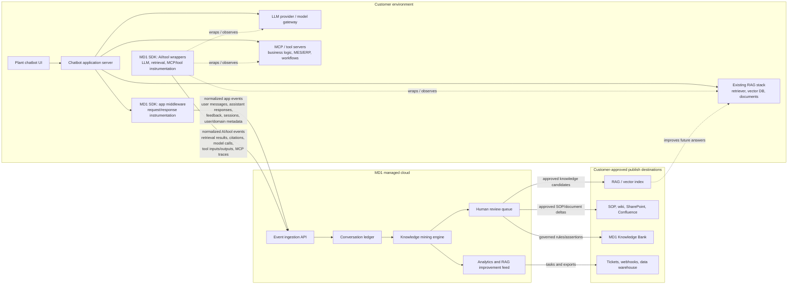

# MD1 Context SDK

## Turn plant chatbot conversations into operating knowledge.

Most manufacturing AI assistants can only retrieve what is already written down. But the most valuable plant context often appears around the edges of those answers: corrections, frustration, exceptions, workarounds, local judgment, and repeated questions the RAG system cannot answer.

**MD1 Context SDK** sits inside an existing plant chatbot at the server layer and mines conversations for the operating knowledge the system is currently missing. It turns chat traffic into reviewed knowledge candidates, RAG improvement tasks, and visibility into where the plant AI system is earning or losing trust.

## The Problem

Manufacturers are piloting chatbots and RAG systems on top of SOPs, manuals, MES/ERP data, and internal documents. These systems answer questions, but they rarely improve themselves from usage.

They often cannot tell:

- Which domains are failing repeatedly.
- Which written sources are missing, stale, or misleading.
- When an operator says, "No, that's wrong."
- Which process exceptions only experienced people know.
- Which experts are implicitly carrying critical context.
- What conversation evidence should become new operating knowledge.

RAG retrieves documented knowledge. **MD1 mines what conversations reveal is missing, wrong, local, disputed, or known only by experienced people.**

## The Solution

MD1 Context SDK is a lightweight server-side SDK for manufacturing AI teams that already have a chatbot or RAG application.

The SDK captures normalized conversation events, sends them to MD1 Context Cloud, and produces three outputs:

1. **Knowledge candidate queue**
   Proposed rules, assertions, SOP deltas, exceptions, thresholds, decision logic, unresolved expert questions, and contradictions.

2. **Chatbot intelligence**
   Usage by domain, user role, process area, sentiment, trust signals, unanswered clusters, adoption, and repeated failure patterns.

3. **RAG improvement feed**
   Missing sources, weak chunks, bad citations, stale references, retrieval misses, and suggested index improvements.

## What MD1 Mines

| Signal | What it means |
| --- | --- |
| Adjacent operating context | The SOP says one thing, but the real plant context depends on line, product, supplier, season, or equipment state. |
| Corrections and disagreement | Operators reject or correct an answer: "No, that's wrong," "That misses the grade change," or "We stopped doing that after the incident." |
| Process exceptions | The chatbot exposes where standard rules break down under local conditions. |
| Sentiment and trust | Frustration, skepticism, repeated re-asking, abandonment, escalation, confidence, or positive reinforcement. |
| Missing-source demand | Users ask questions the RAG corpus cannot answer because the right document, chunk, metadata, or context is missing. |
| Expert and domain patterns | The system identifies who corrects answers, who gets referenced, and which domains depend on unwritten judgment. |

## System Architecture

The default deployment is MD1 managed cloud. The customer's chatbot, RAG stack, documents, vector database, user auth, tool/MCP servers, and LLM provider remain in the customer environment. The MD1 SDK runs in the customer's chatbot server and sends normalized telemetry to MD1 Context Cloud.

The SDK has two instrumentation layers:

- **App middleware** monitors chatbot API inputs and outputs: user messages, assistant responses, sessions, feedback, user role, plant area, and outcome signals.
- **AI/tool wrappers** monitor LLM calls, retrieval calls, citations, MCP/tool server inputs and outputs, and business-logic traces.

This matters because the useful context is not only in the final chat transcript. It also lives in the retrieved chunks, discarded sources, tool calls, failed MCP actions, MES/ERP lookups, business-rule decisions, and model responses that the user never sees.

MD1 Context Cloud owns event ingestion, the conversation ledger, signal extraction, analytics, candidate generation, and the human review queue. Nothing is published back into customer systems until a candidate is approved.

Security and deployment controls include server-side API keys, configurable redaction, field allowlists, tenant isolation, audit logs, data retention controls, and future options for VPC deployment, customer-hosted collectors, or derived-signals-only mode.

## Why This Is Different

Generic LLM observability tools help teams trace, evaluate, and debug AI applications. MD1 is narrower and more valuable for manufacturing: it converts plant chatbot usage into governed operating knowledge.

The product is not another chatbot, not a replacement RAG stack, and not a generic analytics dashboard. It is a knowledge mining layer for manufacturing AI systems.

## Buyer

The first buyer is the manufacturing AI or digital transformation lead who already owns a plant chatbot, RAG pilot, or AI assistant program.

Their question is no longer, "Can we build a chatbot?"

It is:

**"How do we prove it is working, improve it over time, and capture the plant knowledge users reveal while using it?"**

## Implementation Wedge

Start with a small integration:

1. Add the MD1 Context SDK to the chatbot server.
2. Capture conversations, retrieval context, citations, feedback, user role, process area, and outcomes.
3. Mine signals into candidate knowledge and RAG improvement tasks.
4. Route high-confidence candidates to human review.
5. Publish approved knowledge back into the RAG index first, then optionally into SOP repositories, ticketing systems, or MD1 Knowledge Bank.

## Positioning Line

**MD1 Context SDK turns plant chatbot conversations into reviewed operating knowledge, so every AI interaction makes the system smarter.**

## Competitive Context

Products such as LangSmith, Langfuse, Arize Phoenix, and Humanloop focus on LLM observability, tracing, evaluation, prompt management, and debugging. MD1 should learn from that category, but position away from generic AI engineering workflows and toward manufacturing-specific knowledge mining.

The wedge is:

**Observability tells you what happened. MD1 tells you what the plant learned.**
